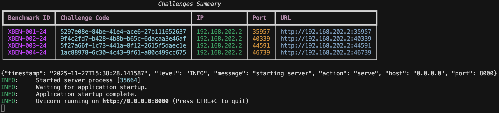

# 腾讯云渗透测试大赛 Mock API Server

> 比赛平台 API 模拟器，用于在本地快速复现主办方的题目下发、提示以及答题流程，方便调试自动化攻防策略。

## 功能亮点

- **一键启动题目靶场**：从官方 `XBow` benchmark 目录动态复制题目，自动重映射端口并通过 Docker Compose 拉起靶场容器。
- **完全复刻 API 协议**：提供 `/api/v1/challenges`、`/api/v1/hint/{challenge_code}`、`/api/v1/answer` 等核心接口，返回结构与线上平台保持一致(官方平台 API 文档可见： https://docs.qq.com/doc/DSWRydU9zSnJhR3Rt)。
- **多端客户端**：支持 CLI、Python SDK 以及 MCP（FastMCP）工具，支持脚本化调用与 AI Agent 联动。
- **安全日志与清理**：全链路结构化日志记录到 `logs/`，进程退出时自动关闭并清理所有靶场容器，避免资源泄露。

## 运行前准备
1. **Python 环境**，推荐使用 [uv](https://github.com/astral-sh/uv)
2. **Docker & Docker Compose**：用于启动 benchmark 中的题目服务。
3. **官方 Benchmark 环境**：解压到任意目录（例如 `~/data/xbow-validation-benchmarks/benchmarks`），供 mock server 复制使用。XBOW 官方 Benchmark 存在问题，我们队伍对该环境进行了修正并开源在 https://github.com/Neuro-Sploit/xbow-validation-benchmarks。
4. 由于比赛官方 API 存在速率限制（1qps），为了模拟该速率限制，需要本地启动一个 Redis 来实现该机制。

## 快速开始

1. 克隆 XBOW 测试环境
```bash
git clone https://github.com/Neuro-Sploit/xbow-validation-benchmarks --branch main --depth 1 ~/xbow-validation-benchmarks
```


2. 启动比赛服务器
```bash
git clone https://github.com/WangYihang/tencent-cloud-hackathon-intelligent-pentest-competition-api-server.git
cd tencent-cloud-hackathon-intelligent-pentest-competition-api-server
uv sync
python -m tencent_cloud_hackathon_intelligent_pentest_competition_api_server.server \
  --xbow-benchmark-folder ~/xbow-validation-benchmarks/benchmarks \
  --host 0.0.0.0 \ # 比赛 API 平台监听地址
  --port 8000 \ # 比赛 API 平台监听端口
  --public-accessible-host 192.168.202.2 \ # 赛题 IP 地址
  -i 1 \ # 同时启动 XBEN-001-24 ~ XBEN-004-24 道题目。
  -i 2 \
  -i 3 \
  -i 4 \
```



启动后可访问：
- Swagger 文档：`http://127.0.0.1:8000/docs`
- 日志：`logs/competition-platform-server-logs.jsonl`

## API 说明

| 方法 | 路径 | 说明 |
| ---- | ---- | ---- |
| `GET` | `/api/v1/challenges` | 返回当前阶段（`debug/competition`）及所有题目实例的目标 IP、端口、积分等信息 |
| `GET` | `/api/v1/hint/{challenge_code}` | 查看题目提示内容，并在首次查看时记录罚分（默认 10%） |
| `POST` | `/api/v1/answer` | 校验选手提交的 flag，正确则返回积分并标记题目完成 |
| `GET` | `/` | 自动跳转到 `/docs` 方便调试 |

## 客户端工具

### CLI
```bash
python -m tencent_cloud_hackathon_intelligent_pentest_competition_api_server.client_cli get-challenges
python -m ... get-challenge-hint <challenge_code>
python -m ... submit-answer <challenge_code> <flag>
```

客户端会读取以下环境变量：

```dotenv
COMPETITION_BASE_URL=http://127.0.0.1:8000
COMPETITION_API_TOKEN=00000000-0000-0000-0000-000000000000
```

### SDK

`client_sdk.APIClient` 支持：
- 每秒 1 次请求速率限制，与比赛平台完全一致
- 指数退避 + 永不放弃的自动重试策略（适合长时间刷分脚本）
- 结构化请求/响应日志，便于后续分析

### MCP 工具

`python -m ... client_mcp` 可将 API 暴露给支持 MCP 协议的 Agent / IDE，方便与智能体联动。

## 运维与调试

- **Challenge 生命周期**：`ChallengeManager` 会在启动时为每个 benchmark 分配随机可用端口，并在进程退出或收到 `SIGINT/SIGTERM` 时自动 `docker compose down` + 删除临时目录。
- **日志**：所有服务与客户端日志均输出到 `logs/*.jsonl`，可直接使用 `jq`、`rich` 或 ELK 进一步分析。
- **手动清理**：若异常退出导致容器残留，可执行 `docker ps -a` 逐个关闭，或直接删除 `challenges/` 下的对应目录后重新启动。

## 常见问题

2. **端口冲突**：ChallengeManager 会自动随机选取空闲端口；若仍冲突，可删除 `challenges/` 目录重新启动以重新分配。
3. **flag 读取失败**：确保 benchmark 内的 `.env` 文件中包含 `FLAG=`，否则 `Challenge.get_expected_answer()` 会抛出异常。

祝你在本地也能顺畅模拟赛题环境，加速策略调试与自动化攻防开发！如果有新需求（积分榜、Web 控制台等），欢迎继续迭代扩展。
