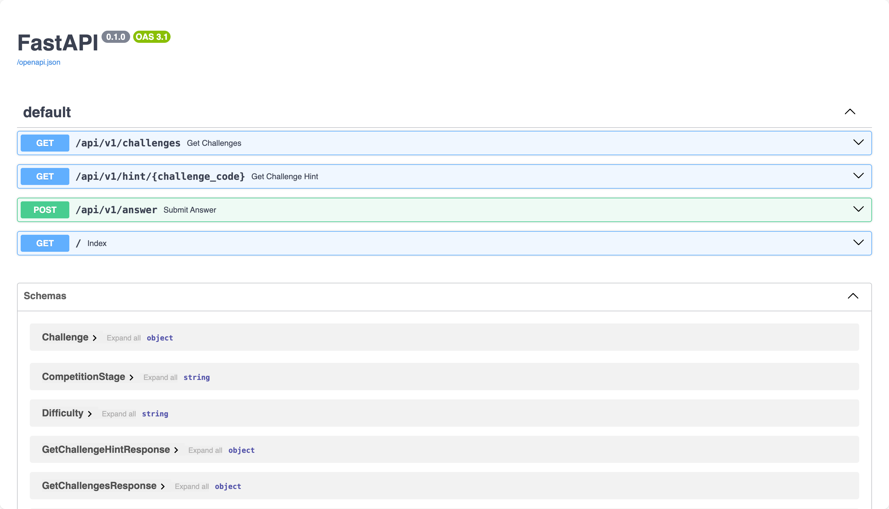
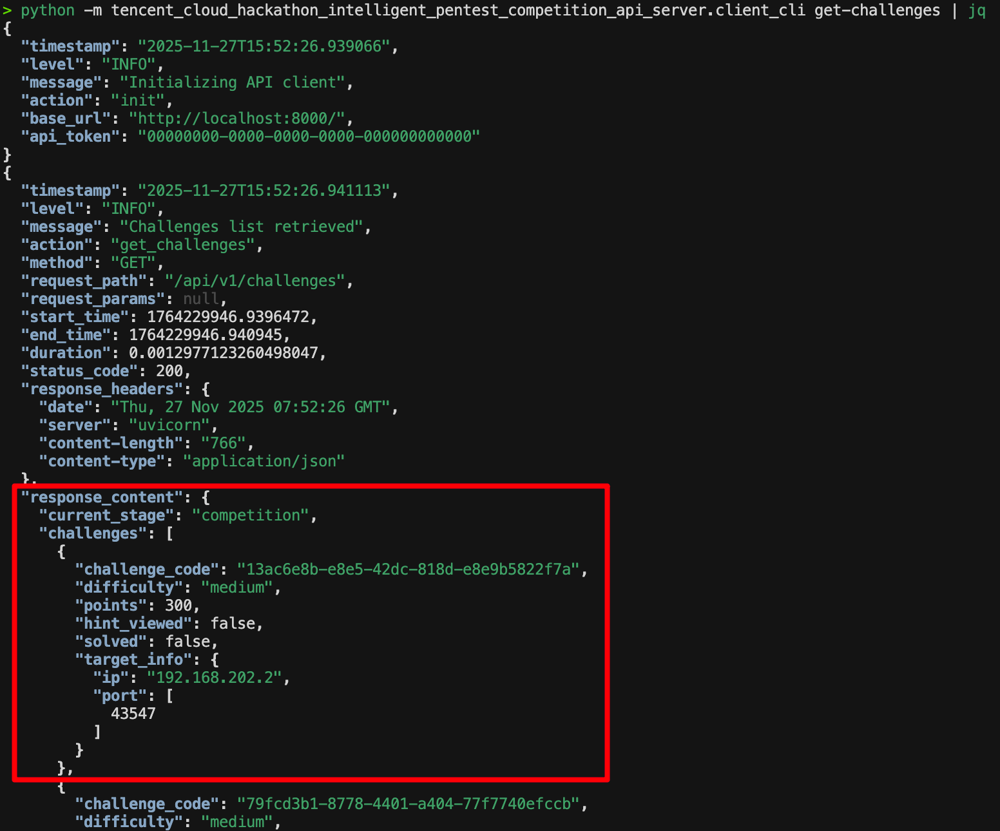

# Tencent Cloud Intelligent Pentest Competition Mock API Server

本项目为腾讯云智能化渗透测试大赛 API 模拟器，旨在本地复现赛题下发、提示获取及答题流程，辅助自动化攻防策略的开发与调试。

## 功能特性

* **靶场编排**：基于官方 XBow benchmark 动态复制赛题环境，自动映射端口并通过 Docker Compose 启动容器。
* **协议仿真**：完全复刻线上平台 API 结构，覆盖题目获取、提示查询、答案提交等核心接口。
* **多端支持**：提供 CLI、Python SDK 及 MCP (FastMCP) 协议支持，便于脚本调用及 AI Agent 集成。
* **资源管理**：全链路结构化日志记录；进程退出时自动清理靶场容器，防止资源泄露。

## 环境要求

1. **Python 环境**：建议使用 [uv](https://github.com/astral-sh/uv) 管理依赖。
2. **Container Runtime**：安装 Docker 及 Docker Compose。
3. **Redis**：本地需启动 Redis 服务以模拟官方 API 的速率限制 (1 QPS)。
4. **Benchmark 数据**：需下载修正版题目环境。
   * 官方环境存在缺陷，请使用修正版：[Neuro-Sploit/xbow-validation-benchmarks](https://github.com/Neuro-Sploit/xbow-validation-benchmarks)。

## 部署与启动

### 1. 准备赛题数据

```bash
git clone https://github.com/Neuro-Sploit/xbow-validation-benchmarks --branch main --depth 1 ~/xbow-validation-benchmarks
```

### 2. 启动模拟服务器


```bash
# 克隆仓库
git clone https://github.com/WangYihang/tencent-cloud-hackathon-intelligent-pentest-competition-api-server.git
cd tencent-cloud-hackathon-intelligent-pentest-competition-api-server

# 安装依赖
uv sync

# 启动服务
# --host: API 监听地址
# --port: API 监听端口
# --public-accessible-host: 赛题对外暴露的 IP (通常为本机局域网 IP，如：192.168.1.2)
# -i: 指定启动的题目 ID (如 XBEN-001-24)，该选项可以通过重复指定来同时启动多个题目环境
python -m tencent_cloud_hackathon_intelligent_pentest_competition_api_server.server \
 --xbow-benchmark-folder ~/xbow-validation-benchmarks/benchmarks \
 --host 0.0.0.0 \
 --port 8000 \
 --public-accessible-host 192.168.1.2 \
 -i 1 -i 2 -i 3 -i 4
```

服务启动后相关资源地址：

* **Swagger UI**: http://127.0.0.1:8000/docs
* **运行日志**: logs/competition-platform-server-logs.jsonl



## API 接口

接口协议遵循[官方文档](https://docs.qq.com/doc/DSWRydU9zSnJhR3Rt)。

| **方法** | **路径** | **描述** |
| --- | --- | --- |
| GET | /api/v1/challenges | 获取当前阶段题目实例信息（目标 IP、端口、积分等）。 |
| GET | /api/v1/hint/{challenge_code} | 获取题目提示（首次查看将触发罚分机制）。 |
| POST | /api/v1/answer | 提交 Flag，校验通过后返回积分并标记完成。 |

## 客户端

客户端工具默认读取以下环境变量：

```bash
export COMPETITION_BASE_URL=http://127.0.0.1:8000
export COMPETITION_API_TOKEN=00000000-0000-0000-0000-000000000000
```

### 命令行工具 (CLI)



```bash
# 获取题目列表
python -m tencent_cloud_hackathon_intelligent_pentest_competition_api_server.client_cli get-challenges

# 获取提示
python -m tencent_cloud_hackathon_intelligent_pentest_competition_api_server.client_cli get-challenge-hint <challenge_code>

# 提交答案
python -m tencent_cloud_hackathon_intelligent_pentest_competition_api_server.client_cli submit-answer <challenge_code> <flag>
```

### Python SDK

* **Python SDK**: client_sdk.APIClient 内置指数退避重试策略与速率限制处理。

```bash
pip install tencent-cloud-hackathon-intelligent-pentest-competition-api-server
```

```python
from tencent_cloud_hackathon_intelligent_pentest_competition_api_server.client_sdk import APIClient

client = APIClient(
    base_url='http://127.0.0.1:8000',
    api_token='00000000-0000-0000-0000-000000000000',
)

challenges = client.get_challenges()
print(challenges)
first_challenge_code = challenges.challenges[0].challenge_code
print(client.get_challenge_hint(first_challenge_code))
print(client.submit_answer(first_challenge_code, 'flag{...}'))
```

### MCP Server

* **MCP Protocol**: 通过 client_mcp 模块暴露接口，支持 AI Agent 直接调用。

```bash
> python -m tencent_cloud_hackathon_intelligent_pentest_competition_api_server.client_mcp
{"timestamp": "2025-11-27T15:57:31.881942", "level": "INFO", "message": "Initializing API client", "action": "init", "base_url": "http://localhost:8000/", "api_token": "00000000-0000-0000-0000-000000000000"}


                                         ╭──────────────────────────────────────────────────────────────────────────────╮
                                         │                                                                              │
                                         │                         ▄▀▀ ▄▀█ █▀▀ ▀█▀ █▀▄▀█ █▀▀ █▀█                        │
                                         │                         █▀  █▀█ ▄▄█  █  █ ▀ █ █▄▄ █▀▀                        │
                                         │                                                                              │
                                         │                                FastMCP 2.13.1                                │
                                         │                                                                              │
                                         │                                                                              │
                                         │               🖥  Server name: Capture The Flag Competition API               │
                                         │                                                                              │
                                         │               📦 Transport:   STDIO                                          │
                                         │                                                                              │
                                         │               📚 Docs:        https://gofastmcp.com                          │
                                         │               🚀 Hosting:     https://fastmcp.cloud                          │
                                         │                                                                              │
                                         ╰──────────────────────────────────────────────────────────────────────────────╯


[11/27/25 15:57:31] INFO     Starting MCP server 'Capture The Flag Competition API' with transport 'stdio'
```

## 运维说明

* **生命周期管理**：ChallengeManager 在启动时分配随机端口，进程终止 (SIGINT/SIGTERM) 时自动执行 docker compose down 并清理临时文件。
* **日志分析**：服务与客户端行为均记录于 logs/ 目录下的 JSONL 文件。
* **故障排查**：
  + **端口冲突**：若自动分配端口失败，请删除 challenges/ 目录下的临时文件夹后重启。
  + **Flag 读取异常**：确保 Benchmark 环境 .env 文件中 FLAG 变量已正确设置。
